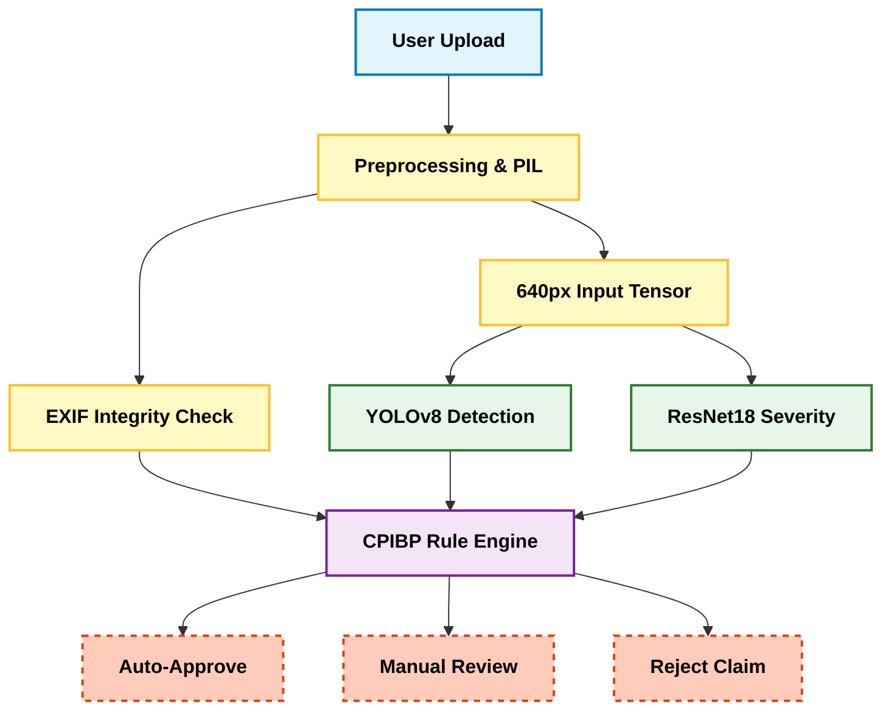

# 🛡️ ClaimsAI: Hybrid AI Insurance Claim Assessment System

An automated, edge-capable vehicle insurance claim processing system. This project utilizes a **Late-Fusion Hybrid Architecture**, combining the perceptive power of Deep Learning (YOLOv8 & ResNet18) with the deterministic safety of a Rule-Based Business Engine (CPIBP) to automate damage assessment and prevent fraud.

## 🌟 Key Features
* **Dual-AI Perception:** Uses **YOLOv8** for instance segmentation and **ResNet18** for global severity classification.
* **CPIBP Rule Engine:** A deterministic logic layer that fuses AI probabilities to make safe, explainable business decisions.
* **Integrity & Fraud Module:** Analyzes EXIF metadata to flag digitally manipulated photos.
* **Role-Based Portals:** Features secure dashboards for both Customers and Insurance Surveyors.

---

## 📐 System Architecture

The system operates on an offline-first, parallel inference pipeline:


## 📁 Project Structure

```text
INSURANCE-CLAIM-AI/
├── app/
│   └── main.py                  # Core backend pipeline execution
├── data/
│   ├── test_images/             # Sample images for testing
│   └── fraud_store.json         # Local signature database
├── fraud/
│   └── fraud_detection.py       # EXIF & Metadata analysis logic
├── inference/
│   ├── severity_infer.py        # ResNet18 severity classification
│   └── yolo_infer.py            # YOLOv8 damage localization
├── models/                      # (Requires Manual Setup)
│   ├── best.pt                  # YOLOv8 trained weights
│   └── severity_model.pth       # ResNet18 trained weights
├── rules/
│   └── cpibp_rules.py           # CPIBP decision logic engine
├── .gitignore                   # Files to exclude from GitHub
├── requirements.txt             # Python dependencies
└── streamlit_app.py             # Main Production UI & Portal

```

## ⚙️ Installation & Local Setup

> **⚠️ Note on Weights:** Due to file size limits, the trained weights are excluded. Place them in the `models/` directory before running.

### 1. Clone the Repository
```bash
git clone [https://github.com/Ravi-Kishan-Kumar/ClaimsAI.git](https://github.com/Ravi-Kishan-Kumar/ClaimsAI.git)
cd ClaimsAI
```

### 2. Setup Virtual Environment
```bash
python -m venv venv
# Windows:
.\venv\Scripts\activate
# Mac/Linux:
source venv/bin/activate
```
### 3. Install Dependencies & Run
```bash
pip install -r requirements.txt
streamlit run streamlit_app.py
```

---

## 🔐 Demo Login Credentials

The prototype features a secure login portal to route users to the correct dashboard.

| Role | Username | Password |
| :--- | :--- | :--- |
| **Customer / User** | `user1` | `123` |
| **Admin / Surveyor** | `surveyor` | `admin` |

---

## 🚀 Future Scope

* **Mobile App Porting:** Transitioning the Streamlit web app to a native mobile application for on-site accident reporting.
* **3D Damage Reconstruction:** Upgrading from 2D image analysis to 360-degree video mesh generation for accurate depth estimation.
* **Automated Cost Estimation:** Linking detected part damages directly to an OEM parts and labor database for end-to-end financial settlement.

## 👥 Team

Ravi Kishan Kumar
Vikas Lalwani